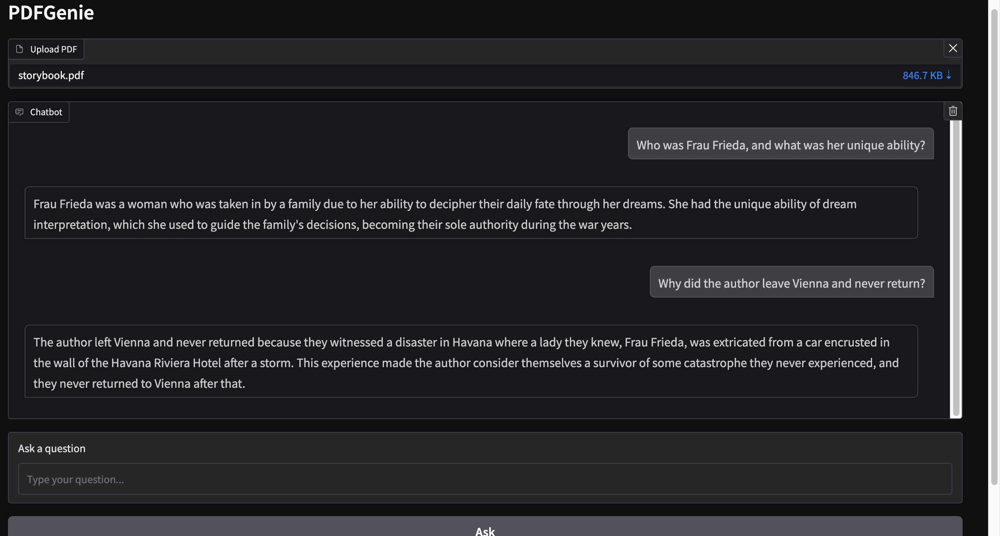

# PDFGenie - AI Chatbot for PDF Files

    

PDFGenie is an AI-powered chatbot that allows users to interact with the contents of PDF documents by asking questions. It uses natural language processing (NLP) and machine learning models to understand and respond to queries based on the content of the uploaded PDF.

## Features

- **PDF Text Extraction**: Extracts text from PDF files.
- **Text Chunking**: Splits text into smaller chunks.
- **Vector Store**: Uses FAISS for fast search.
- **Question-Answering**: Uses Mistral-7B for answering questions.

...

Ensure you have the following installed:

- Python 3.7 or higher
- pip (Python package manager)

Additionally, you need a Hugging Face account and an API token to access the pre-trained models.
